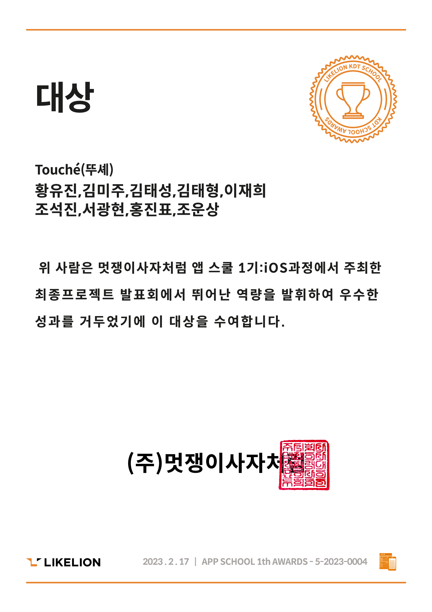

# 뚜셰 (Touché)


## 프로젝트 소개 


> `향수`에 대해 관심을 갖기 시작해, 다양한 `향수` 정보를 얻고 싶은 사람을 위한
> 기본적인 `향수` 정보, 시각화 정보를 제공해 `향수` 정보를 보다 직관적으로 알 수 있도록 돕는 `뚜셰(Touché)` 입니다.


## 멋쟁이 사자처럼 App School 1기 Final Project 대상 수상

<p align=center>
    
</p>

## 앱 설치 실행 가이드
```
elinholic95@icloud.com 으로 연락 주시면 아래 파일을 전달받으실 수 있습니다.
GoogleService-Info.plist

위 파일 없이 간단한 앱 빌드만 필요하시다면, 번들 아이디 com.codelion.ToucheFinal 을 입력해주세요.
```


## Skills & Tech Stack

<p>
  <h4>개발</h4>
    <span>
      
      
      
      
      
    </span>
  <br/>
  <h4>협업 / 디자인</h4>
    <span>
      
      
      
    </span>
    
</p>


## 컨벤션
```
- [Feat] : 새로운 기능 추가
- [Add]: 새로운 파일 추가 (json, img, asset, 목업데이터 등등)
- [Fix] : 버그 수정
- [Docs] : 문서 수정
- [Style] : 코드 포맷팅, 세미콜론 누락, 코드 변경이 없는 경우
- [Refactor] : 코드 리펙토링
- [Test] : 테스트 코드, 리펙토링 테스트 코드 추가
- [Chore] : 빌드 업무 수정, 패키지 매니저 수정
```


### 🗂 Folder Structure

```

📦ToucheFinal
 ┣ 📂ToucheFinal
 ┃ ┣ 📂Assets.xcassets
 ┃ ┣ 📂Extension
 ┃ ┣ 📂Info 2.bundle
 ┃ ┣ 📂Info.bundle
 ┃ ┣ 📂Models
 ┃ ┣ 📂Preview Content
 ┃ ┣ 📂Store
 ┃ ┣ 📂Util
 ┃ ┣ 📂Views
 ┃ ┣ 📂ko.lproj
 ┃ ┣ 📜GoogleService-Info.plist
 ┃ ┣ 📜Info.plist
 ┃ ┣ 📜Language.swift
 ┃ ┗ 📜ToucheFinalApp.swift
 ┣ 📂ToucheFinal.xcodeproj
 ┗ 📜.DS_Store
 
```

### 🎁 Library

| Name              | Version |       |
| ----------------- | :-----: | ----- |
| Firebase          | `9.0.0` | `SPM` |
| SegmentedPicker   | `0.0.2` | `SPM` |
| SDWebImageSwiftUI | `2.2.2` | `SPM` |
| SwiftSoup         | `2.5.3` | `SPM` |
| Magnetic          | `3.3.1` | `SPM` |
| AlertToast        | `1.3.9` | `SPM` |


## 📱구동 화면
|</img>|</img>|</img>|</img>|
|:-:|:-:|:-:|:-:|
|`온보딩뷰`|`매거진`|`필터뷰`|`서치뷰`|
|</img>|</img>|</img>|</img>|
|`향수 상세보기`|`팔레트`|`프로필`|`로그인 및 회원가입`|
<br>

## 참여자
|  |  |  |  |  |
| :----------------------------------------------------------: | :---------------------------------------------: | :-------------------------------------------------: | :-------------------------------------------------: |  :-------------------------------------------------: |
| 미주<br/>[@mumjee03](https://github.com/mumjee03)<br/> | 태성<br/>[@KTS224](https://github.com/KTS224)<br/> | 태형<br/> [@yahoth](https://github.com/yahoth)<br/> | 광현<br/>[@seo-kh](https://github.com/seo-kh)<br/> | 재희<br/>[@jaehee6](https://github.com/jaehee6)<br/> |

<br/>

|  |  |  |  |  |
| :----------------------------------------------------------: | :---------------------------------------------: | :-------------------------------------------------: | :-------------------------------------------------: | :-------------------------------------------------: |
| 석진<br/>[@tjrwls](https://github.com/tjrwls)<br/> | 운상<br/>[@wschooo](https://github.com/wschooo)<br/> | 진표<br/> [@jphong1005](https://github.com/jphong1005)<br/> | 유진<br/>[@yooj1202](https://github.com/yooj1202)<br/> | 뚜셰<br/>[Touché](https://github.com/)<br/> |

## 라이센스

Touché is available under the MIT license. See the [LICENSE](https://github.com/APPSCHOOL1-REPO/finalproject-touche/blob/main/License) file for more info.


## 연관링크
뚜셰 관리자앱 레포지터리: [https://github.com/APPSCHOOL1-REPO/finalproject-touche-admin](https://github.com/APPSCHOOL1-REPO/finalproject-touche-admin)
